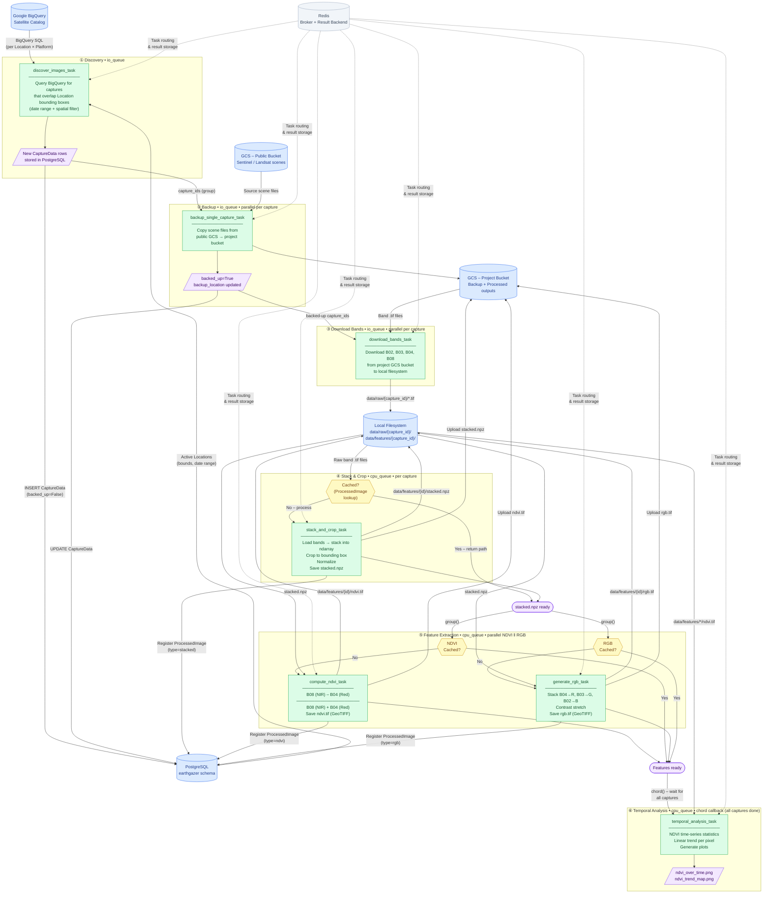

# EarthGazer Processing Workflow

## Full Pipeline Diagram

## Workflow Summary

| Stage | Task | Queue | Parallelism | Input | Output |
|-------|------|-------|-------------|-------|--------|
| ① Discovery | `discover_images_task` | `io_queue` | Single | BigQuery + Locations DB | CaptureData rows in PG |
| ② Backup | `backup_single_capture_task` | `io_queue` | Per capture | Public GCS | Project GCS bucket |
| ③ Download | `download_bands_task` | `io_queue` | Per capture | Project GCS | `data/raw/{id}/*.tif` |
| ④ Stack & Crop | `stack_and_crop_task` | `cpu_queue` | Per capture | Raw `.tif` files | `stacked.npz` |
| ⑤a NDVI | `compute_ndvi_task` | `cpu_queue` | Parallel with RGB | `stacked.npz` | `ndvi.tif` |
| ⑤b RGB | `generate_rgb_task` | `cpu_queue` | Parallel with NDVI | `stacked.npz` | `rgb.tif` |
| ⑥ Analysis | `temporal_analysis_task` | `cpu_queue` | Chord callback | All `ndvi.tif` files | Trend plots |

### Celery Composition Primitives Used

- **`chain`** — sequential steps within a single capture (download → stack → features)
- **`group`** — parallel execution of NDVI and RGB tasks, or parallel backup/download across captures
- **`chord`** — waits for all per-capture processing to finish before triggering temporal analysis
